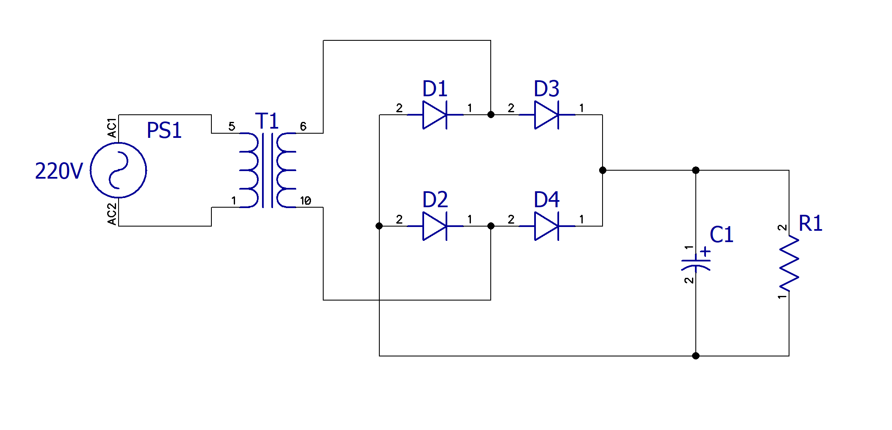
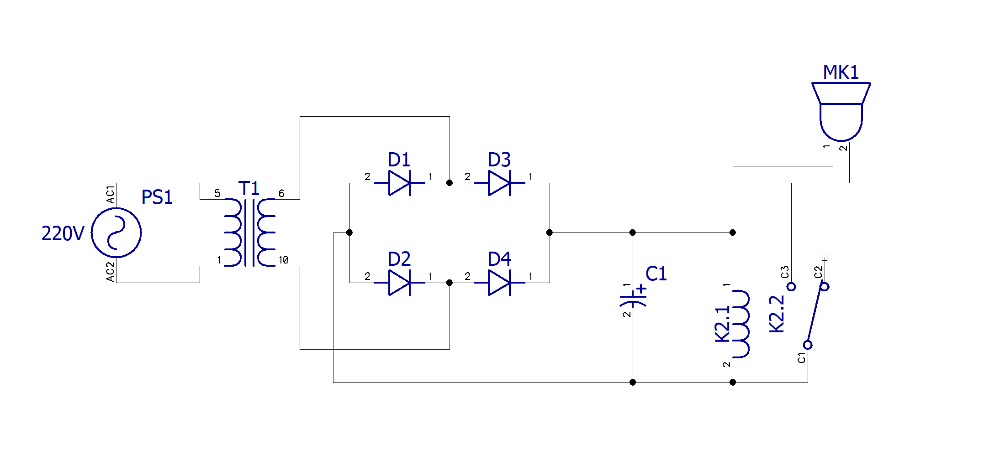
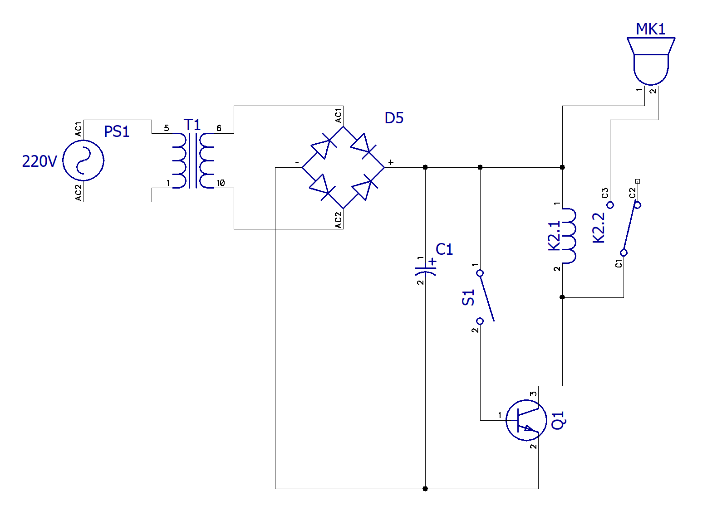
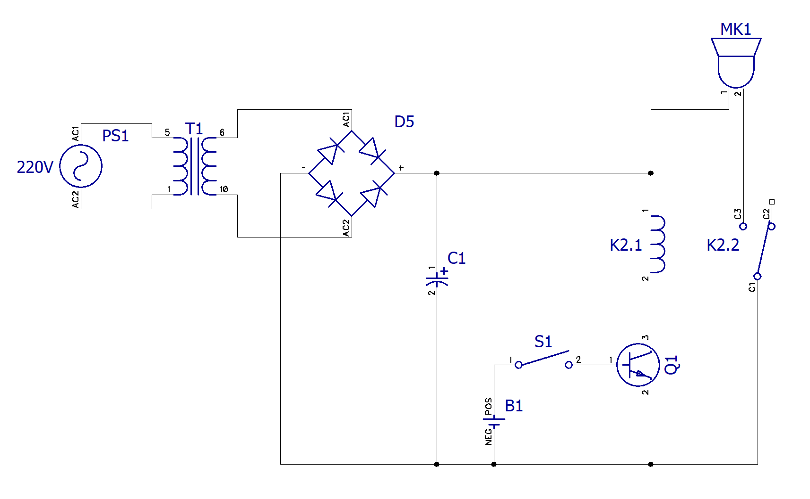

# Практическая работа

## Задание 1

1. Составить в любом редакторе схему на понижающем трансформаторе и выпрямителе для получения напряжения питания 24 В

    * Источник напряжения - переменный ток 
    (синусоида) 220v 50Гц
    
    * Расчитываем вротичное напряжение коонденсатора, для получения $24\ В$ после преобразования (выпрямления) тока через диодный мост *(? Сомнительные расчеты)

        $U_{dc} = 24\ В$ (требуемое напряжение тока после преобразования)

        $U_{diode} = 0,7\ В$ (падение напряжения на одном диоде, примем за основу значение 0,7. На 2х (для диодного моста из 4х диодов) = $1.4\ В$) 

        $U_{rms}$ - напряжение, которое требуется для подачи на диодный мост 
        
        $U_{dc} = U_{rms} * \sqrt {2} - U_{diode} \to 24 = U_{rms}* \sqrt {2} - 1,4 $

        $U_{rms}* \sqrt {2} = 25,4 \to U_{rms} = \dfrac {25,4}{\sqrt {2}}$

        $U_{rms} = 18\ В$

    * Соответственно, если число витков первой обмотки трансформатора $N1 = 220$, число витков второй обмотки трансформатора $N2= 18$.

$$\dfrac {N_1}{N_2} = \dfrac {U_1}{U_2}$$
$$Где\ U1 - входное\ напряжение,\ выходное - U2$$

$$\dfrac {N_2}N_1{U_1} = U_2$$

$$\dfrac {N_2}{N_1} U_1 = U_2 \to U2 = 220*\dfrac {18}{220} = 18\ В$$ 
    
* $K$ (коэффициент трансформации) для получения $18\ В$ на вторичной обмотке

    $$K = \dfrac {220\ В}{18\ В} = 12,2$$

* Конденсатор (для выравнивания постоянного тока), не зная ток нагрузки, возьмем пока просто емкостью 2.2мФ

2. Подключить лампу к питающему напряжению через электромагнитное реле

3. Подключите управляющие контакты электромагнитного реле к транзистору по оптимальной для этой задачи схеме из занятия 1. Расчитайте ток для выбранного реле

Примем за основу, что $R_{катушки\ реле} = 9,6\ Ом$ (как в лекции)

$I_{катушки\ реле} = \dfrac {U}{R_{катушки\ реле}} = 2,5\ A$

4. Выведите контакты для управления 3.3В (для цифровых блоков управления)

Примем за основу, что ток на батарее В1 - 3,3В

5. Расчитайте потребляемую схемой мощность

Примем за основу, что ток нагрузки лампы $I_{лампы} = 1\ A$.

$U = 24\ В$

$R_{лампы} = \dfrac {U}{I} = \dfrac {24}{1} = 24\ Ом$

Ток в цепи коллектора транзистора $I=2,5\ A$ (ток поступающий из катушки реле)

Падение напряжения на транзисторе $U_{кэ} = 1,2\ В$

$I_к= \dfrac {U-U_{кэ}}{R}= \dfrac {24 - 1,2}{9,6} = 2,375\ А$

Значит 

$R_{к} = \dfrac {U}{I_{к}} = \dfrac {24}{2,375} = 10,1\ Ом$

Учитывая, что на схеме катушка реле и лампочка соеденены параллельно, общее сопротивление на схеме будет равно:

$R_{схемы} = \dfrac {R_{лампы}*R_{к}}{R_{лампы}+R_{к}} = \dfrac {24*10,1}{24+10,1} = 7,1\ Ом$ 

Тогда:

$I_{общий} = \dfrac {U}{R_{схемы}} = \dfrac {24}{7,1} = 3,38$

Или:

$I_{общий} = I_{лампы} + I_{к} = 2,375 + 1 = 3,375$

$P = U * I = 24  В * 3,375  А = 81  Вт$ 

6. соотнесите потребляемую мощность, с габаритной мощностью трансформатора

$P = 81  Вт$ - потребляемая схемой мощность и будет ореинтиром для выбора мощности трансформатора  

* Для надежной работы трансформатор должен иметь запас мощности, обычно в 1,5-2 раза больше расчетной мощности, или минимум 5% дополнительно от расчетной (как в лекции).

* Возьмем трансформатор с запасом мощности в 5% раза, то есть с $P = 85,2\ Вт$, округлим в большую сторону, итого $P = 86\ Вт$.

Ток в первичной обмотке трансформатора (для оценки сечения проводника)

$P_1 = P_2 \to U_1 I_1 \to I_1= \dfrac {P_2}{U_1} = \dfrac {81}{220} = 0,368\ А = 368\ мА$

7. Расчитайте ток в цепи для оценки надежности работы выпрямительной схемы.

$I_{общий} = 3,375$ (расчеты из задания 1.5)

Пример подходящего диода для диодного моста 1N5408:

* Прямой ток: 3 А

* Обратное напряжение: 1000 В

Выпрямительная схема считается надежной, если режим ее работы не превышает 90% номинальных значений, указанных в паспорте (datasheet) на дискретные схемы

Учитывая, что падение напряжения на диоде у нас $0,7 В$. то выходное напряжение после выпрямителя будет:

$U_{на\ выходе} = U - 1,4В = 24В - 1,4В = 22,6В$

8. Составьте схему электрическую на понижающем трансформаторе, выпрямителе, транзисторе и реле.

## Задание 2

Рассчитайте:

‌  
$P_{схемы}$ = 86 Вт (мощность трансформатора с запасом)

‌  
$N_{схемы}$ = 5% (надёжность трансформатора, запас мощности)

